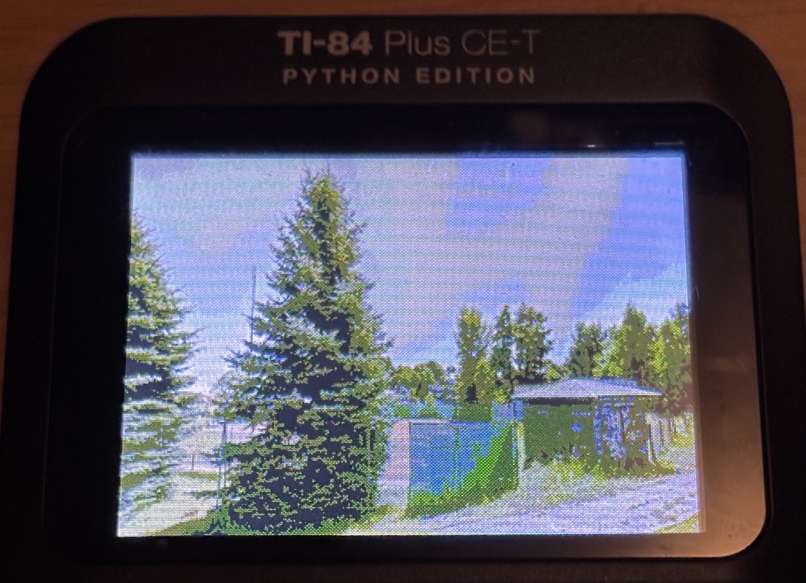

# geoterm

> [!WARNING]
> This project is in an extremely early stage and completely non-functional.

geoterm is a simple and to the point implementation of Geoguessr.

## Goal

Port the game to many different devices, the first of which is the TI84 calculator.
The plan is eventually to refine the implementation to work with almost anything,
but the calculator is the primary goal for the time being.

## Structure

Effectively, there are three large parts behind a full working game.
The server, the transponder, and the client. In the case of good hardware, the
transponder is not required.

The server is fairly simple, the client is intended to display the information and
collect input, whereas the transponder simply forwards requests. In the case of this repository,
it acts as a proxy between the TCP server and the serial connection with the calculator.

This implementation is fairly simple, but still flexible. The transponder is typically a very simple
piece of software, with the main challenge centered around the clients.

## Projects

There are several different related projects in this repository. A brief overview is
detailed here.

| Name/Path            | Language | Status          | Description                                        |
| -------------------- | -------- | --------------- | -------------------------------------------------- |
| `server`             | Rust     | Mostly finished | The main game server.                              |
| `shared`             | Rust     | Finished        | Types and utilities for the tokio client & server. |
| `clients/tui`        | Rust     | Finished        | A rough TUI client for the game.                   |
| `clients/ti84`       | C        | Mostly finished | The TI84 client.                                   |
| `transponders/tokio` | Rust     | Finished        | A simple transponder, designed for PC use.         |
| `transponders/esp32` | Rust (?) | Not yet started | A transponder for the esp32 microcontroller.       |

## Protocol

See [PROTOCOL.md](PROTOCOL.md).
